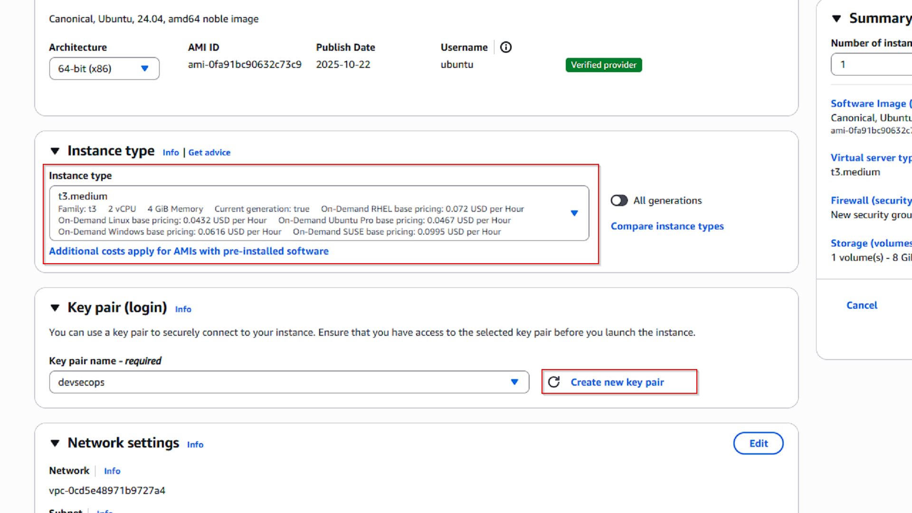
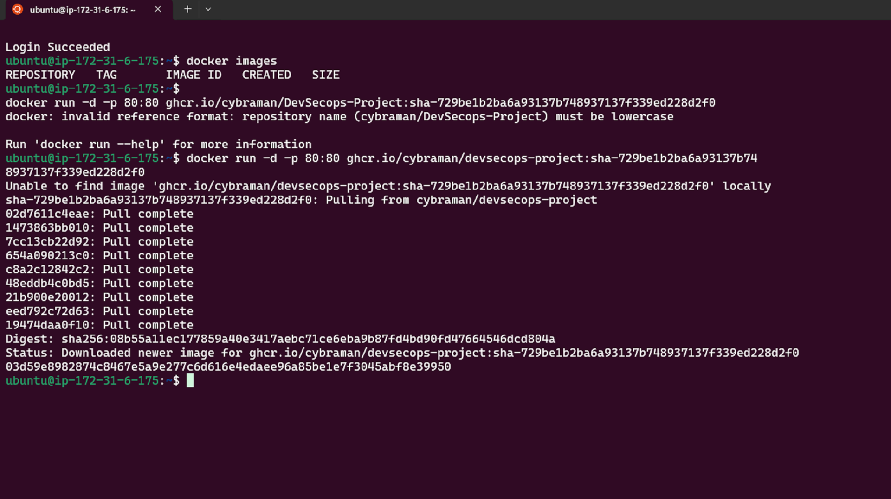
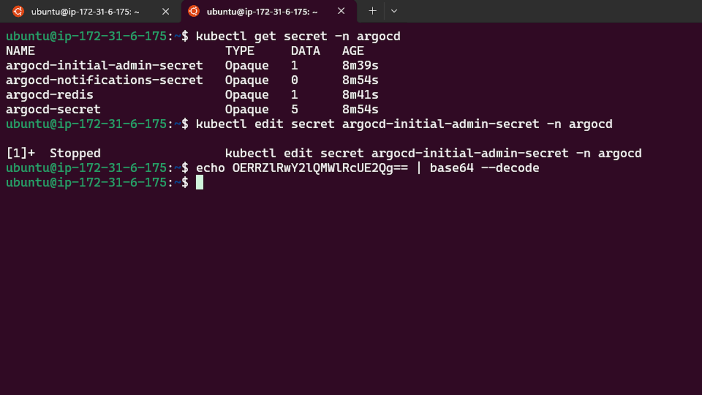
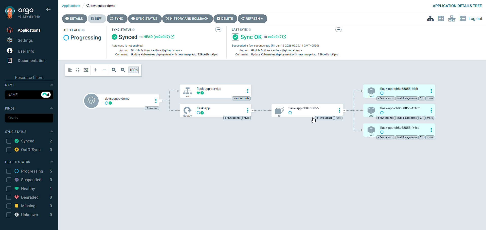
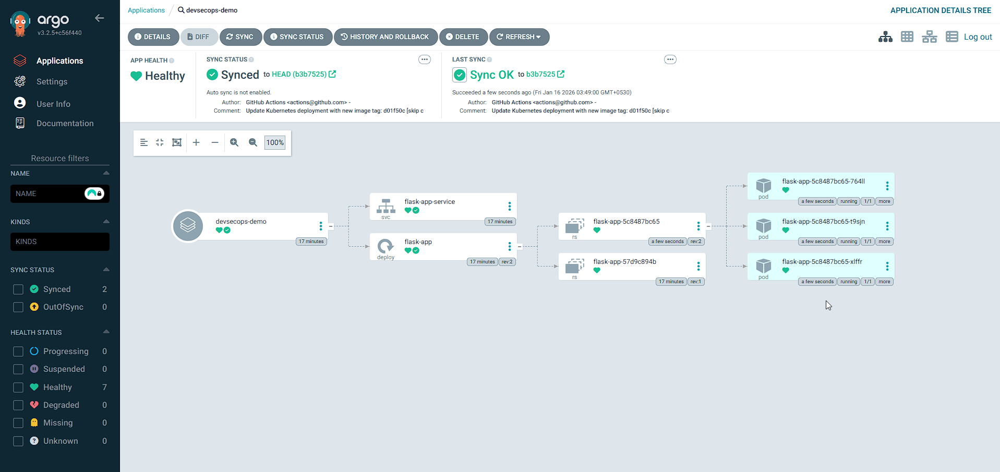

<!-- Banner -->


# DevSecOps Pipeline Starter

---

## Tech Stack & Project Badges

<p align="left">
  
  
  
  
  
  
  
  <a href="https://github.com/cybraman/devsecops-project/actions"></a>
  <a href="https://github.com/cybraman/devsecops-project/blob/main/LICENSE"></a>
  <a href="https://github.com/cybraman/devsecops-project/graphs/contributors"></a>
  <a href="https://github.com/cybraman/devsecops-project/issues"></a>
  <a href="https://github.com/cybraman/devsecops-project/stargazers"></a>
</p>

---

## Table of Contents

- [Project Overview](#project-overview)
- [Repo Structure](#repo-structure)
- [App Features](#app-features)
- [UI Preview](#ui-preview)
- [Local Installation & Setup](#local-installation--setup)
- [Docker Build & Local Testing](#docker-build--local-testing)
- [DevSecOps Pipeline](#devsecops-pipeline-step-by-step)
- [Images & Screenshots](#images--screenshots)
- [Troubleshooting](#troubleshooting)
- [Contributing](#contributing)
- [Resources](#resources)
- [License](#license)

---

## Project Overview

- **App:** Simple Flask web app with UI and API endpoints
- **Pipeline:** GitHub Actions → Security Scans → Container Registry → AWS EC2 → Kubernetes (kind) → Argo CD (GitOps)
- **Goal:** Learn, build, and deploy like a real DevSecOps team!

---

## Repo Structure

```
app/                  # Flask app source
  templates/          # HTML UI
  static/             # CSS
tests/                # Unit tests
Dockerfile            # Container build instructions
.github/workflows/    # GitHub Actions pipeline
kubernetes/           # Kubernetes manifests (Deployment/Service)
images/               # Supporting screenshots & diagrams
```

---

## App Features

| Route           | Method | Description                                 |
|-----------------|--------|---------------------------------------------|
| `/`             | GET    | Serves the UI page (index.html)             |
| `/api/status`   | GET    | Returns JSON status (used by UI button)     |
| `/health`       | GET    | Health endpoint for readiness checks        |

> **Why `/health`?**  
> Used by load balancers, Kubernetes probes, and uptime monitors.

---

## UI Preview

*The web UI running locally at http://localhost:5000*

---

## DevSecOps Pipeline: Step-by-Step

### A. Git Workflow

1. **Commit & Push Changes**
   ```bash
   git add .
   git commit -m "describe what you changed"
   git push origin main
   ```
2. **Sync with Remote (Rebase)**
   ```bash
   git pull --rebase origin main
   ```
   > _Keeps history clean by replaying your commits on top of the latest remote changes._


---

## Local Installation & Setup

### 1. Clone the Repository
```bash
git clone https://github.com/<your-username>/<repo-name>.git
cd <repo-name>
```

### 2. Install Python Dependencies
```bash
cd app
pip install -r requirements.txt
```

### 3. Run the Flask App Locally
```bash
python main.py
```
- Access the app at: [http://localhost:5000](http://localhost:5000)

### 4. Run Unit Tests
```bash
pytest ../tests
```

---

### B. GitHub Token & Repo Secrets

- **Never share your personal access token!**  
  If exposed, revoke it immediately.

#### 1. Create a GitHub Personal Access Token (PAT)
- Go to: GitHub → Settings → Developer settings → Personal access tokens
- Recommended scopes:
  - `read:packages`
  - `write:packages`
  - `repo` (if needed)


#### 2. Add Token to Repo Secrets
- Go to: Repo → Settings → Secrets and variables → Actions
- Add:
  - `GHCR_TOKEN`
  - `GHCR_USERNAME`


---

### C. AWS EC2 Setup

#### 1. Launch EC2 Instance
- **Name:** devsecops-demo
- **OS:** Ubuntu 22.04
- **Type:** t3.medium
- **Storage:** 20–30 GB
- **Security Group:** Allow SSH (22), HTTP (80), and custom ports (5000, 30080, 9000)





#### 2. SSH into EC2
```bash
ssh -i ~/Documents/devsecops.pem ubuntu@<EC2_PUBLIC_IP>
```


---

### D. Install Docker on EC2

```bash
sudo apt update
sudo apt install docker.io -y
sudo usermod -aG docker ubuntu
newgrp docker
docker --version
docker ps
```

---

### E. Run the Container

1. **Login to GHCR (if private):**
   ```bash
   docker login ghcr.io
   ```
2. **Run the app:**
   ```bash
   docker run -d -p 5000:5000 ghcr.io/<github-username>/<image-name>:latest
   ```
3. **Check:**
   ```bash
   docker ps
   curl http://localhost:5000/health
   ```




---

### F. Install kind (Kubernetes in Docker)

```bash
curl -Lo ./kind https://kind.sigs.k8s.io/dl/v0.31.0/kind-linux-amd64
chmod +x ./kind
sudo mv ./kind /usr/local/bin/kind
kind version
kind create cluster --name devsecops-demo
```


---

### G. Install kubectl

```bash
curl -LO "https://dl.k8s.io/release/$(curl -L -s https://dl.k8s.io/release/stable.txt)/bin/linux/amd64/kubectl"
sudo install -o root -g root -m 0755 kubectl /usr/local/bin/kubectl
kubectl version --client
kubectl config current-context
kubectl get nodes
```


---

### H. Install Argo CD (GitOps)

```bash
kubectl create namespace argocd
kubectl apply -n argocd -f https://raw.githubusercontent.com/argoproj/argo-cd/stable/manifests/install.yaml
kubectl get pods -n argocd -w
```


#### Access Argo CD UI

```bash
kubectl get svc -n argocd
kubectl port-forward svc/argocd-server -n argocd 9000:443 --address 0.0.0.0
```
- Open: `https://<EC2_PUBLIC_IP>:9000`


#### Get Argo CD Admin Password

```bash
kubectl -n argocd get secret argocd-initial-admin-secret -o jsonpath="{.data.password}" | base64 -d; echo
```

- **Username:** admin
- **Password:** (output above)






---

### I. Kubernetes Image Pull Secret (for GHCR)

```bash
export GHCR_TOKEN="paste_token_here"
kubectl create secret docker-registry github-container-registry \
  --docker-server=ghcr.io \
  --docker-username=<github-username> \
  --docker-password=<github-token> \
  --docker-email=<email>
unset GHCR_TOKEN
```


---

### J. Deploy with Argo CD

- Add your Kubernetes manifests to `kubernetes/`
- Create an Argo CD Application pointing to that folder
- Argo will sync automatically
- Push a commit and pipeline will run successfully





---


## Docker Build & Local Testing

### 1. Build the Docker Image
```bash
docker build -t devsecops-webui:latest .
```

### 2. Run the Docker Container
```bash
docker run -d -p 5000:5000 devsecops-webui:latest
```
- Access the app at: [http://localhost:5000](http://localhost:5000)

### 3. Health Check
```bash
curl http://localhost:5000/health
```

---

## Troubleshooting

1. **Docker login fails:**
   - Check token scopes and registry URL
2. **Argo CD UI not reachable:**
   - Check port-forward and EC2 security group
3. **Kubernetes can’t pull image:**
   - Ensure secret exists and is referenced in your Deployment

For more help, see [GitHub Discussions](https://github.com/cybraman/devsecops-project/discussions) or open an issue.

---

## Contributing

We welcome contributions! Please follow these steps:

1. Fork the repository ([cybraman/devsecops-project](https://github.com/cybraman/devsecops-project))
2. Create a feature branch (`git checkout -b feature/your-feature`)
3. Commit your changes (`git commit -m "Add your feature"`)
4. Push to your branch (`git push origin feature/your-feature`)
5. Open a Pull Request ([PRs](https://github.com/cybraman/devsecops-project/pulls))

### Issue & PR Templates
- Use the provided issue template for bug reports and feature requests ([Issues](https://github.com/cybraman/devsecops-project/issues))
- Use the PR template for clear, descriptive pull requests ([PRs](https://github.com/cybraman/devsecops-project/pulls))

---

## Troubleshooting

For more help, see [GitHub Discussions](https://github.com/cybraman/devsecops-project/discussions) or open an [issue](https://github.com/cybraman/devsecops-project/issues).

---

## Resources

- [Project Repository](https://github.com/cybraman/devsecops-project)
- [Flask Documentation](https://flask.palletsprojects.com/)
- [GitHub Actions](https://docs.github.com/en/actions)
- [Docker](https://docs.docker.com/)
- [Kubernetes](https://kubernetes.io/docs/)
- [Argo CD](https://argo-cd.readthedocs.io/en/stable/)

---

## License

MIT License — see [LICENSE](https://github.com/cybraman/devsecops-project/blob/main/LICENSE) for details.

---

> _Happy DevSecOps-ing!_ 🚀
